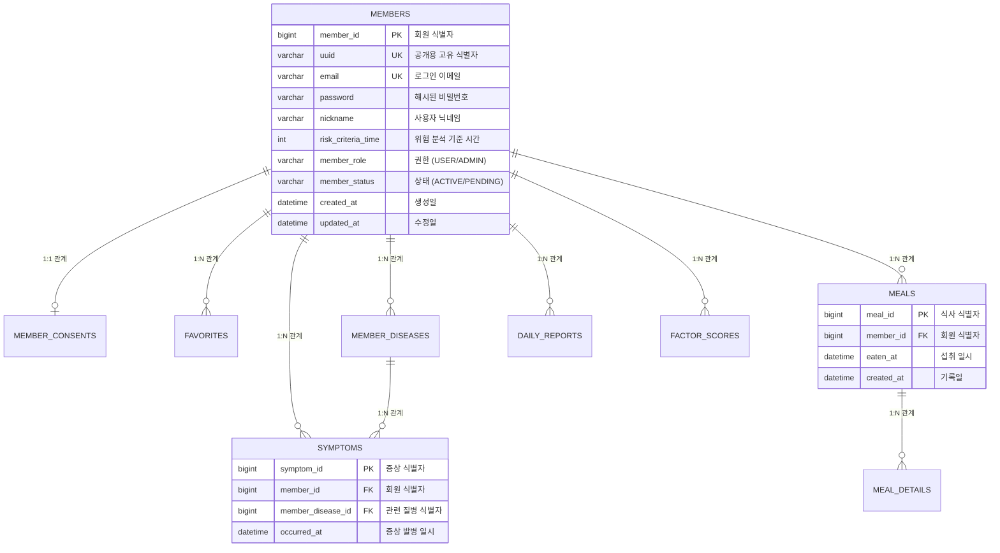

# 📊 Welog 데이터베이스 설계 명세서 (v1.0.0)

## 1. 개요 (Overview)
본 문서는 **Welog** 서버의 데이터베이스 스키마에 대한 상세 명세를 제공합니다. RDBMS의 베스트 프렉티스를 준수하여 정규화, 데이터 무결성 및 성능을 고려하여 설계되었습니다.

### 1.1 목적
- 시스템 데이터 모델의 명확한 구조적 개요 제공
- 백엔드 개발자 및 데이터베이스 관리자를 위한 참조 자료
- 서비스 전반에 걸친 일관된 데이터 관리 보장

---

## 2. 일반 규칙 (General Conventions)
### 2.1 명명 규칙 (Naming Rules)
- **테이블(Tables)**: 스네이크 케이스(Snake-case), 복수형 (예: `members`, `daily_reports`).
- **컬럼(Columns)**: 스네이크 케이스(Snake-case), 단수형 (예: `member_id`, `created_at`).
- **키(Keys)**:
  - 기본키(Primary Key): `[테이블_단수형]_id` (예: `member_id`).
  - 외래키(Foreign Key): `[대상_테이블_단수형]_id`.

### 2.2 감사 컬럼 (Audit Columns)
모든 주요 엔티티는 `BaseTimeEntity`를 상속하며 다음 컬럼을 포함합니다:
- `created_at`: `DATETIME` (Not Null, 수정 불가) - 생성 일시
- `updated_at`: `DATETIME` (Not Null) - 최종 수정 일시

---

## 3. 개체 관계도 (Entity Relationship Diagram)

---

## 4. 논리적 스키마 정의 (Logical Schema Definitions)

### 4.1 계정 관리 도메인 (Account Management Domain)

#### [Table: members]
사용자의 기본 계정 정보 및 설정.
| 컬럼명 | 타입 | Null 허용 | 키 | 기본값 | 설명 |
| :--- | :--- | :--- | :--- | :--- | :--- |
| member_id | BIGINT | N | PK | | 내부 식별 ID |
| uuid | VARCHAR(36) | N | UK | | S3 경로 및 API 노출용 식별자 |
| email | VARCHAR(100) | N | UK | | 사용자 로그인 이메일 |
| password | VARCHAR(255) | N | | | 암호화된 비밀번호 |
| nickname | VARCHAR(50) | N | | | 사용자 표시 닉네임 |
| risk_criteria_time | INT | N | | 120 | 증상 분석 골든타임 기준(분) |
| member_role | VARCHAR(20) | N | | USER | RBAC 권한: USER, ADMIN |
| member_status | VARCHAR(20) | N | | PENDING | 상태: ACTIVE, PENDING, DELETED |
| provider | VARCHAR(50) | Y | | | OAuth 제공자 (google, kakao 등) |
| fcm_token | VARCHAR(255) | Y | | | Firebase 디바이스 토큰 |

#### [Table: member_consents]
서비스 이용약관 및 개인정보 처리방침 동의 기록.
| 컬럼명 | 타입 | Null 허용 | 키 | 설명 |
| :--- | :--- | :--- | :--- | :--- |
| consent_id | BIGINT | N | PK | 동의 기록 식별자 |
| member_id | BIGINT | N | FK, UK | 관련 회원 식별자 |
| privacy_policy_agreed | BOOLEAN | N | | 개인정보 처리방침 동의 여부 |
| terms_of_service_agreed| BOOLEAN | N | | 서비스 이용약관 동의 여부 |
| agreed_version | VARCHAR(20) | N | | 동의 당시의 정책 버전 |

---

### 4.2 기록 및 활동 도메인 (Record & Activity Domain)

#### [Table: meals]
식사 섭취 이벤트에 대한 상위 메타데이터.
| 컬럼명 | 타입 | Null 허용 | 키 | 설명 |
| :--- | :--- | :--- | :--- | :--- |
| meal_id | BIGINT | N | PK | 식사 기록 식별자 |
| member_id | BIGINT | N | FK | 소유 회원 식별자 |
| eaten_at | DATETIME | N | | 실제 음식 섭취 일시 |
| image_url | VARCHAR(512) | Y | | S3에 저장된 식사 사진 URL |

#### [Table: meal_details]
식사에 포함된 구체적인 요인들.
| 컬럼명 | 타입 | Null 허용 | 키 | 설명 |
| :--- | :--- | :--- | :--- | :--- |
| meal_detail_id | BIGINT | N | PK | 상세 항목 식별자 |
| meal_id | BIGINT | N | FK | 부모 식사 식별자 |
| factor_name | VARCHAR(100) | N | | 음식/재료/태그 이름 |
| factor_type | VARCHAR(20) | N | | 요인 분류 (MENU, PLACE 등) |

#### [Table: symptoms]
질병과 연관된 증상 발병 기록.
| 컬럼명 | 타입 | Null 허용 | 키 | 설명 |
| :--- | :--- | :--- | :--- | :--- |
| symptom_id | BIGINT | N | PK | 증상 기록 식별자 |
| member_id | BIGINT | N | FK | 소유 회원 식별자 |
| member_disease_id | BIGINT | N | FK | 관련 질병 식별자 |
| occurred_at | DATETIME | N | | 증상 발병 일시 |

---

### 4.3 통계 및 분석 도메인 (Statistics & Analysis Domain)

#### [Table: factor_scores]
요인별 누적 위험 지표.
- **제약 조건**: 복합 유니크 키 (`member_id`, `factor_name`, `factor_type`)
  
| 컬럼명 | 타입 | Null 허용 | 설명 |
| :--- | :--- | :--- | :--- |
| member_id | BIGINT | N | 관련 회원 식별자 |
| factor_name | VARCHAR(100) | N | 요인 이름 |
| factor_type | VARCHAR(20) | N | 요인 분류 |
| eat_count | INT | N | 총 섭취/노출 횟수 |
| sick_count | INT | N | 증상과 연관된 횟수 |
| risk_score | DOUBLE | N | 계산된 위험 점수 (0-100) |

---

## 5. 도메인 코드 (Enums)

### 5.1 FactorType
`meal_details`, `favorites`, `factor_scores` 테이블에서 사용되는 분류 코드입니다.
| 코드 | 설명 | 예시 |
| :--- | :--- | :--- |
| MENU | 구체적인 메뉴 이름 | 비빔밥, 파스타 |
| INGREDIENT | 특정 식재료 | 새우, 우유 |
| FLAVOR | 맛의 프로필 | 매운맛, 기름진 |
| RESTAURANT | 식사 장소 | 회사 식당, 편의점 |
| TIME | 시간대 및 상황 | 야식, 공복 |

---

## 6. 개정 이력 (Revision History)
| 버전 | 날짜 | 내용 | 작성자 |
| :--- | :--- | :--- | :--- |
| v1.0.0 | 2026-03-27 | 초기 데이터베이스 설계 명세서 작성 | 백엔드 팀 |
