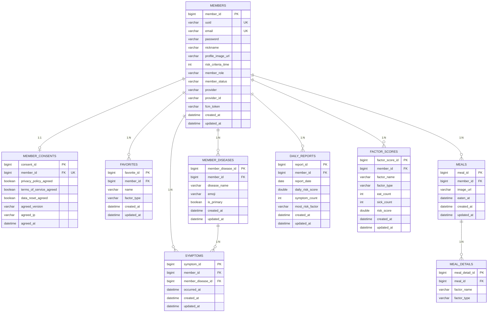

# 📊 WeLog (위로그) V1.0 - Database Schema (ERD)

> **Version:** 1.0  
> **Date:** 2026.01  
> **Description:** WeLog 서비스의 핵심 데이터 모델링 명세서입니다. 회원, 기록, 분석 도메인으로 구성되어 있습니다.

---

## 1. 👤 회원 및 설정 (Member Domain)

### `members` (회원)
사용자 계정 정보 및 개인화 설정 데이터를 관리합니다.

| Column Name | Type | Key | Nullable | Default | Description |
| :--- | :--- | :--- | :--- | :--- | :--- |
| `member_id` | `BIGINT` | **PK** | N | Auto Inc | 회원 고유 ID |
| `email` | `VARCHAR(100)` | **UK** | N | | 로그인 이메일 |
| `password` | `VARCHAR(255)` | | N | | BCrypt 암호화 비밀번호 |
| `nickname` | `VARCHAR(50)` | | N | | 사용자 닉네임 |
| `profile_image_url` | `VARCHAR(512)` | | Y | | 프로필 이미지 URL (MinIO) |
| `risk_criteria_time` | `INT` | | N | 18 | 소화 유효 시간 (시간 단위) |
| `role` | `VARCHAR(20)` | | N | 'USER' | 권한 (USER, ADMIN) |
| `status` | `VARCHAR(20)` | | N | 'ACTIVE' | 상태 (ACTIVE, BANNED) |
| `provider` | `VARCHAR(20)` | | Y | | 소셜 로그인 제공자 (GOOGLE) |
| `provider_id` | `VARCHAR(255)` | | Y | | 소셜 로그인 식별값 |
| `fcm_token` | `VARCHAR(512)` | | Y | | 앱 푸시 토큰 |
| `created_at` | `DATETIME` | | N | | 가입일 |
| `updated_at` | `DATETIME` | | N | | 수정일 |

### `member_diseases` (관리 질병)
사용자가 관리 중인 질병 목록입니다. (다중 선택 가능)

| Column Name | Type | Key | Nullable | Default | Description |
| :--- | :--- | :--- | :--- | :--- | :--- |
| `member_disease_id` | `BIGINT` | **PK** | N | Auto Inc | ID |
| `member_id` | `BIGINT` | **FK** | N | | 대상 회원 ID |
| `disease_name` | `VARCHAR(100)` | | N | | 질병명 (예: 역류성 식도염) |
| `is_primary` | `BOOLEAN` | | N | False | 대표 질병 여부 (★) |
| `created_at` | `DATETIME` | | N | | 등록일 |

### `favorites` (즐겨찾기)
입력 편의를 위해 사용자가 등록한 즐겨찾기 목록입니다. (회원가입 시 '집밥' 자동 등록)

| Column Name | Type | Key | Nullable | Default | Description |
| :--- | :--- | :--- | :--- | :--- | :--- |
| `favorite_id` | `BIGINT` | **PK** | N | Auto Inc | ID |
| `member_id` | `BIGINT` | **FK** | N | | 대상 회원 ID |
| `name` | `VARCHAR(100)` | | N | | 즐겨찾기 이름 (예: 집밥) |
| `factor_type` | `VARCHAR(20)` | | N | | 타입 (MENU, RESTAURANT 등) |

---

## 2. 📝 기록 도메인 (Log Domain)

### `meals` (식사 기록)
사용자가 기록한 식사 이벤트 자체를 저장합니다.

| Column Name | Type | Key | Nullable | Default | Description |
| :--- | :--- | :--- | :--- | :--- | :--- |
| `meal_id` | `BIGINT` | **PK** | N | Auto Inc | 식사 ID |
| `member_id` | `BIGINT` | **FK** | N | | 작성자 ID |
| `image_url` | `VARCHAR(512)` | | Y | | 음식 사진 URL |
| `eaten_at` | `DATETIME` | **IX** | N | | **실제 섭취 시간** (분석 기준) |
| `created_at` | `DATETIME` | | N | | DB 저장 시간 |
| `updated_at` | `DATETIME` | | N | | 수정 시간 |

### `meal_details` (식사 상세 요인)
식사에 포함된 메뉴, 재료, 식당, 태그 등을 개별 Row로 저장합니다. (Factor 분석의 원천 데이터)

| Column Name | Type | Key | Nullable | Default | Description |
| :--- | :--- | :--- | :--- | :--- | :--- |
| `meal_detail_id` | `BIGINT` | **PK** | N | Auto Inc | ID |
| `meal_id` | `BIGINT` | **FK** | N | | 부모 식사 ID |
| `factor_name` | `VARCHAR(100)` | **IX** | N | | 요인 이름 (예: 마라탕, 매운) |
| `factor_type` | `VARCHAR(20)` | | N | | `MENU`, `INGREDIENT`, `FLAVOR`, `TEXTURE`, `CONDITION`, `RESTAURANT`, `TIME` |

### `symptoms` (증상 기록)
사용자가 '아파요' 버튼을 눌렀을 때의 발병 기록입니다.

| Column Name | Type | Key | Nullable | Default | Description |
| :--- | :--- | :--- | :--- | :--- | :--- |
| `symptom_id` | `BIGINT` | **PK** | N | Auto Inc | 증상 ID |
| `member_id` | `BIGINT` | **FK** | N | | 작성자 ID |
| `disease_name` | `VARCHAR(100)` | | N | | 발병 원인 질병 (당시의 대표 질병) |
| `occurred_at` | `DATETIME` | **IX** | N | | **발병 시간** (분석 기준) |
| `created_at` | `DATETIME` | | N | | DB 저장 시간 |

---

## 3. 📊 분석 및 통계 (Analysis Domain)

### `factor_scores` (위험도 점수표)
배치(Batch)가 1시간마다 계산한 요인별 위험도 점수입니다. (Redis 캐싱 대상)

| Column Name | Type | Key | Nullable | Default | Description |
| :--- | :--- | :--- | :--- | :--- | :--- |
| `factor_score_id` | `BIGINT` | **PK** | N | Auto Inc | ID |
| `member_id` | `BIGINT` | **FK** | N | | 대상 회원 ID |
| `factor_name` | `VARCHAR(100)` | **UK** | N | | 요인 이름 |
| `eat_count` | `INT` | | N | 0 | 총 섭취 횟수 |
| `sick_count` | `INT` | | N | 0 | 발병 연관 횟수 |
| `risk_score` | `DOUBLE` | | N | 0.0 | **위험도 점수 (0~100)** |
| `updated_at` | `DATETIME` | | N | | 마지막 계산 시간 |

> **Note:** `UK`는 `(member_id, factor_name)` 복합 유니크 키입니다.

### `daily_reports` (통계 리포트)
캘린더 및 그래프 조회를 위한 일별 요약 데이터입니다.

| Column Name | Type | Key | Nullable | Default | Description |
| :--- | :--- | :--- | :--- | :--- | :--- |
| `report_id` | `BIGINT` | **PK** | N | Auto Inc | ID |
| `member_id` | `BIGINT` | **FK** | N | | 대상 회원 ID |
| `report_date` | `DATE` | **IX** | N | | 리포트 날짜 (YYYY-MM-DD) |
| `daily_risk_score` | `DOUBLE` | | Y | | 일일 종합 위험도 |
| `symptom_count` | `INT` | | N | 0 | 일일 발병 횟수 |
| `most_risk_factor` | `VARCHAR(100)` | | Y | | 당일 최고 위험 요인 |

---

## 4. 데이터 관계 (Relationships)

주요 테이블 간의 참조 무결성 및 카디널리티(Cardinality) 정의입니다.

### 4.1. 회원 (Member) 중심
*   **Member (1) : MemberDisease (N)**
    *   한 명의 회원은 여러 개의 관리 질병을 가질 수 있습니다.
    *   `Cascade: ALL` (회원 탈퇴 시 질병 목록 삭제)
*   **Member (1) : Favorite (N)**
    *   한 명의 회원은 여러 개의 즐겨찾기를 가질 수 있습니다.
    *   `Cascade: ALL`
*   **Member (1) : Meal (N)**
    *   한 명의 회원은 수많은 식사 기록을 남깁니다.
    *   `Cascade: ALL`
*   **Member (1) : Symptom (N)**
    *   한 명의 회원은 수많은 증상 기록을 남깁니다.
    *   `Cascade: ALL`

### 4.2. 식사 (Meal) 중심
*   **Meal (1) : MealDetail (N)**
    *   하나의 식사 기록은 여러 개의 상세 요인(메뉴, 재료, 맛 등)을 포함합니다.
    *   **생명주기:** `Meal`이 생성/삭제될 때 `MealDetail`도 함께 생성/삭제됩니다. (`Cascade: ALL`, `OrphanRemoval: true`)

### 4.3. 분석 (Analysis) 중심
*   **Member (1) : FactorScore (N)**
    *   회원별로 각 요인(Factor)에 대한 위험도 점수가 N개 존재합니다.
    *   `FactorScore`는 배치를 통해 생성/갱신되므로 `Cascade` 설정보다는 배치 로직에서 관리합니다.
*   **Member (1) : DailyReport (N)**
    *   회원별로 날짜마다 하나의 리포트가 생성됩니다.

## 5. ERD Diagram

