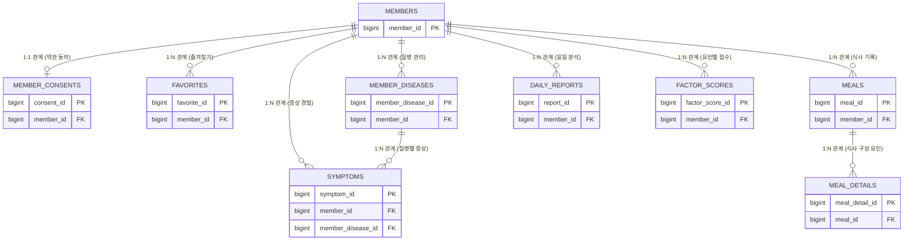

# 📊 Welog 데이터베이스 설계 명세서 (v1.0.0)

## 1. 개요 (Overview)
본 문서는 **Welog** 서버의 데이터베이스 스키마에 대한 상세 명세를 제공합니다. RDBMS의 베스트 프렉티스를 준수하여 정규화, 데이터 무결성 및 성능을 고려하여 설계되었습니다.

### 1.1 목적
- 시스템 데이터 모델의 명확한 구조적 개요 제공
- 백엔드 개발자 및 데이터베이스 관리자를 위한 참조 자료
- 서비스 전반에 걸친 일관된 데이터 관리 보장

---

## 2. 일반 규칙 (General Conventions)
### 2.1 명명 규칙 (Naming Rules)
- **테이블(Tables)**: Snake-case, 복수형 (예: `members`, `daily_reports`).
- **컬럼(Columns)**: Snake-case, 단수형 (예: `member_id`, `created_at`).
- **키(Keys)**:
  - 기본키(Primary Key): `[테이블_단수형]_id` (예: `member_id`).
  - 외래키(Foreign Key): `[대상_테이블_단수형]_id`.

### 2.2 공통 컬럼 (Audit Columns)
모든 주요 엔티티는 `BaseTimeEntity`를 통해 다음 컬럼을 포함합니다.
- `created_at`: 생성 일시 (최초 저장 시 자동 기록)
- `updated_at`: 최종 수정 일시 (변경 시 자동 갱신)

---

## 3. 개체 관계도 (Entity Relationship Diagram)

> 각 테이블 간의 관계를 시각화한 도표입니다. 상세 속성은 하단의 **4. 논리적 스키마 정의**를 참조하십시오.

---

## 4. 논리적 스키마 정의 (Logical Schema Definitions)

### 4.1 계정 관리 도메인

#### [Table: members]
| 컬럼명 | 타입 | Null | Key | 설명 |
| :--- | :--- | :--- | :--- | :--- |
| **member_id** | BIGINT | N | PK | 시스템 고유 식별 ID |
| **uuid** | VARCHAR(36) | N | UK | S3 경로 및 API 노출용 외부 식별자 |
| **email** | VARCHAR(100) | N | UK | 로그인 이메일 계정 |
| **password** | VARCHAR(255) | N | | 암호화된 비밀번호 |
| **nickname** | VARCHAR(50) | N | | 사용자 활동 닉네임 |
| **risk_criteria_time** | INT | N | | 증상 분석 골든타임 기준(분) |
| **member_role** | VARCHAR(20) | N | | 권한 정책 (USER, ADMIN) |
| **member_status** | VARCHAR(20) | N | | 계정 상태 (ACTIVE, PENDING, DELETED) |

#### [Table: member_consents]
| 컬럼명 | 타입 | Null | Key | 설명 |
| :--- | :--- | :--- | :--- | :--- |
| **consent_id** | BIGINT | N | PK | 동의 기록 고유 식별자 |
| **member_id** | BIGINT | N | FK, UK | 관련 회원 ID |
| **privacy_policy_agreed**| BOOLEAN | N | | 개인정보 처리방침 동의 여부 |
| **terms_of_service_agreed**| BOOLEAN | N | | 서비스 이용약관 동의 여부 |

---

### 4.2 기록 및 활동 도메인

#### [Table: meals]
| 컬럼명 | 타입 | Null | Key | 설명 |
| :--- | :--- | :--- | :--- | :--- |
| **meal_id** | BIGINT | N | PK | 식사 기록 식별자 |
| **member_id** | BIGINT | N | FK | 소유 회원 식별자 |
| **eaten_at** | DATETIME | N | | 실제 음식 섭취 일시 |
| **image_url** | VARCHAR(512) | Y | | 식사 사진 URL (S3) |

#### [Table: meal_details]
| 컬럼명 | 타입 | Null | Key | 설명 |
| :--- | :--- | :--- | :--- | :--- |
| **meal_detail_id** | BIGINT | N | PK | 상세 항목 식별자 |
| **meal_id** | BIGINT | N | FK | 연결된 식사 ID |
| **factor_name** | VARCHAR(100) | N | | 요인 이름 (메뉴명, 장소 등) |
| **factor_type** | VARCHAR(20) | N | | 요인 분류 (Enum) |

#### [Table: symptoms]
| 컬럼명 | 타입 | Null | Key | 설명 |
| :--- | :--- | :--- | :--- | :--- |
| **symptom_id** | BIGINT | N | PK | 증상 기록 식별자 |
| **member_id** | BIGINT | N | FK | 소유 회원 식별자 |
| **member_disease_id** | BIGINT | N | FK | 관련 질병 ID |
| **occurred_at** | DATETIME | N | | 증상 발병 일시 |

---

### 4.3 분석 및 통계 도메인

#### [Table: factor_scores]
| 컬럼명 | 타입 | Null | 설명 |
| :--- | :--- | :--- | :--- |
| **member_id** | BIGINT | N | 관련 회원 식별자 |
| **factor_name** | VARCHAR(100) | N | 요인 이름 |
| **factor_type** | VARCHAR(20) | N | 요인 분류 |
| **eat_count** | INT | N | 누적 섭취 횟수 |
| **sick_count** | INT | N | 증상 발현 연관 횟수 |
| **risk_score** | DOUBLE | N | 계산된 위험도 점수 (0-100) |

---

## 5. 도메인 코드 (Enums)

### 5.1 FactorType (요인 분류)
| 코드 | 설명 | 예시 |
| :--- | :--- | :--- |
| MENU | 음식 메뉴명 | 마라탕, 짜장면 |
| INGREDIENT | 특정 식재료 | 우유, 밀가루 |
| FLAVOR | 맛의 특징 | 아주 매운맛, 자극적인 |
| RESTAURANT | 장소/식당 | 회사 식당, 편의점 |
| CONDITION | 신체 상태 | 공복 상태, 과음 후 |

---

## 6. 개정 이력 (Revision History)
| 버전 | 날짜 | 내용 | 작성자 |
| :--- | :--- | :--- | :--- |
| v1.0.0 | 2024-03-21 | 초기 데이터베이스 설계 명세서 작성 | 백엔드 팀 |
