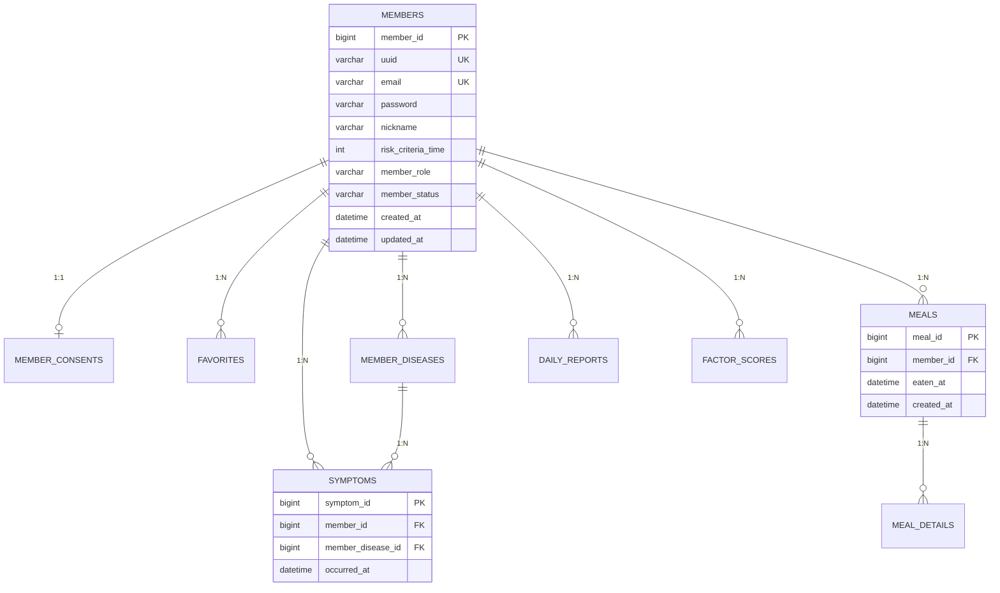

# 📊 Welog Database Design Specification (v1.0.0)

## 1. Overview
This document provides a detailed specification of the database schema for the **Welog** server. The design follows RDBMS best practices for normalization, data integrity, and performance.

### 1.1 Purpose
- To provide a clear structural overview of the system's data model.
- To serve as a reference for backend developers and database administrators.
- To ensure consistent data management across the service.

---

## 2. General Conventions
### 2.1 Naming Rules
- **Tables**: Snake-case, plural (e.g., `members`, `daily_reports`).
- **Columns**: Snake-case, singular (e.g., `member_id`, `created_at`).
- **Keys**:
  - Primary Key: `[table_singular]_id` (e.g., `member_id`).
  - Foreign Key: `[target_table_singular]_id`.

### 2.2 Audit Columns
All primary entities must inherit from `BaseTimeEntity` and include:
- `created_at`: `DATETIME` (Not Null, Updatable: False)
- `updated_at`: `DATETIME` (Not Null)

---

## 3. Entity Relationship Diagram (ERD)

---

## 4. Logical Schema Definitions

### 4.1 Account Management Domain

#### [Table: members]
Primary user account information and preferences.
| Name | Type | Nullable | Key | Default | Description |
| :--- | :--- | :--- | :--- | :--- | :--- |
| member_id | BIGINT | N | PK | | Internal ID |
| uuid | VARCHAR(36) | N | UK | | Public identifier for S3/API |
| email | VARCHAR(100) | N | UK | | User login email |
| password | VARCHAR(255) | N | | | Hashed password |
| nickname | VARCHAR(50) | N | | | User display name |
| risk_criteria_time | INT | N | | 120 | Golden time threshold (min) |
| member_role | VARCHAR(20) | N | | USER | RBAC: USER, ADMIN |
| member_status | VARCHAR(20) | N | | PENDING | ACTIVE, PENDING, DELETED |
| provider | VARCHAR(50) | Y | | | google, kakao, etc. |
| fcm_token | VARCHAR(255) | Y | | | Firebase Cloud Messaging token |

#### [Table: member_consents]
Terms of service and privacy policy agreements.
| Name | Type | Nullable | Key | Description |
| :--- | :--- | :--- | :--- | :--- |
| consent_id | BIGINT | N | PK | Record ID |
| member_id | BIGINT | N | FK, UK | Associated Member ID |
| privacy_policy_agreed | BOOLEAN | N | | Consent to privacy policy |
| terms_of_service_agreed| BOOLEAN | N | | Consent to Terms of Service |
| agreed_version | VARCHAR(20) | N | | Version of the policy agreed upon |

---

### 4.2 Record & Activity Domain

#### [Table: meals]
Top-level intake event metadata.
| Name | Type | Nullable | Key | Description |
| :--- | :--- | :--- | :--- | :--- |
| meal_id | BIGINT | N | PK | Meal record ID |
| member_id | BIGINT | N | FK | Owner Member ID |
| eaten_at | DATETIME | N | | Time of consumption |
| image_url | VARCHAR(512) | Y | | S3 Image URL |

#### [Table: meal_details]
Granular components of a meal intake.
| Name | Type | Nullable | Key | Description |
| :--- | :--- | :--- | :--- | :--- |
| meal_detail_id | BIGINT | N | PK | Detail item ID |
| meal_id | BIGINT | N | FK | Parent Meal ID |
| factor_name | VARCHAR(100) | N | | Name of food/ingredient/tag |
| factor_type | VARCHAR(20) | N | | Category (MENU, PLACE, etc.) |

#### [Table: symptoms]
Symptom onset records linked to diseases.
| Name | Type | Nullable | Key | Description |
| :--- | :--- | :--- | :--- | :--- |
| symptom_id | BIGINT | N | PK | Symptom record ID |
| member_id | BIGINT | N | FK | Owner Member ID |
| member_disease_id | BIGINT | N | FK | Related Disease ID |
| occurred_at | DATETIME | N | | Time of symptom onset |

---

### 4.3 Statistics & Analysis Domain

#### [Table: factor_scores]
Aggregated risk metrics per factor.
**Constraints**: Composite Unique Key (`member_id`, `factor_name`, `factor_type`)  
| Name | Type | Nullable | Description |
| :--- | :--- | :--- | :--- |
| member_id | BIGINT | N | Associated Member |
| factor_name | VARCHAR(100) | N | Key factor name |
| factor_type | VARCHAR(20) | N | Factor category |
| eat_count | INT | N | Total times consumed |
| sick_count | INT | N | Times associated with symptoms |
| risk_score | DOUBLE | N | Calculated risk (0-100) |

---

## 5. Domain Codes (Enums)

### 5.1 FactorType
Used in `meal_details`, `favorites`, and `factor_scores`.
| Code | Description | Example |
| :--- | :--- | :--- |
| MENU | Specific food name | Bibimbap, Pasta |
| INGREDIENT | Specific ingredient | Shrimp, Milk |
| FLAVOR | Taste profiles | Spicy, Greasy |
| RESTAURANT | Location / Venue | Office Cafeteria |
| TIME | Temporal context | Late night, Empty stomach |

---

## 6. Revision History
| Version | Date | Description | Author |
| :--- | :--- | :--- | :--- |
| v1.0.0 | 2026-03-27 | Initial Database Specification | Backend Team |
